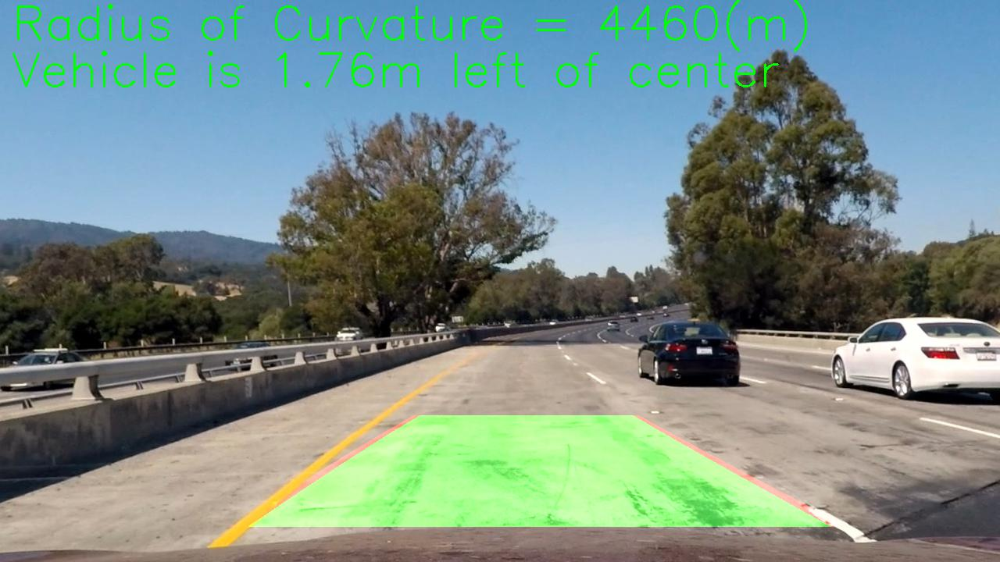
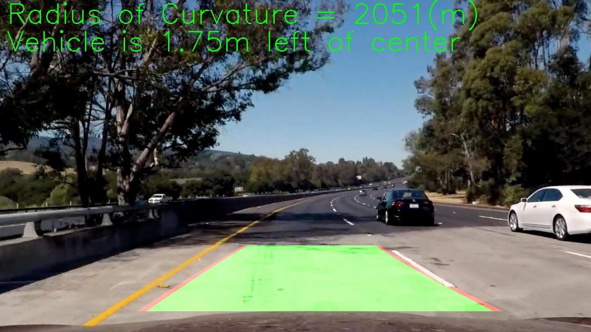

## PROJECT: ReND_Car_Advanced-Lane-Lines
> AUTHOR: SungwookLE(joker1251@naver.com) </br>
> DATE: '21.3/11 </br>
---

### [1] Introduction

The goals / steps of this project are the following:
* Compute the camera calibration matrix and distortion coefficients given a set of chessboard images.
* Apply a distortion correction to raw images.
* Use color transforms, gradients, etc., to create a thresholded binary image.
* Apply a perspective transform to rectify binary image ("birds-eye view").
* Detect lane pixels and fit to find the lane boundary.
* Determine the curvature of the lane and vehicle position with respect to center.
* Warp the detected lane boundaries back onto the original image.
* Output visual display of the lane boundaries and numerical estimation of lane curvature and vehicle position.
* [Rubric](https://review.udacity.com/#!/rubrics/571/view) Points is here

### [2] MAIN

#### [2-1] Camera Calibration
Using `cv2.findChessboardCorners`, `cv2.drawChessboardCorners`, Find and Save `objpoints` and `imgpoints`.
This `points` are chess check board that can make undistort the images. In this project, the chessboard images are
`camera_cal/calibration*.jpg`.

```python
# Chess board (9,6)
objp = np.zeros((6*9, 3), np.float32)
objp[:,:2] = np.mgrid[0:9, 0:6].T.reshape(-1,2) 

for fname in images:
    img = cv2.imread(fname)
    gray = cv2.cvtColor(img, cv2.COLOR_BGR2GRAY)
    # Find the chessboard corners
    ret, corners = cv2.findChessboardCorners(gray, (9,6), None)

    if ret == True:
        imgpoints.append(corners)
        objpoints.append(objp)
        img = cv2.drawChessboardCorners(img, (9,6), corners, ret)
```

#### [2-2] Camera Undistortion
When using the single lense camrea, there is distortion effect. Therefore, `undistortion` process is needed.

```python
def cal_undistort(img, objpoints, imgpoints):
    img_size = (img.shape[1], img.shape[0]) # x, y
    ret, mtx, dist, rvecs, tvecs = cv2.calibrateCamera(objpoints, imgpoints, img_size, None, None)
    undist = cv2.undistort(img, mtx, dist, None, mtx)

    return undist
```
`objpoints` and `imgpoints` are used for `cv2.calibrateCamera` that returns 'ret','mtx','dist','rvecs','tvecs'.  
Those values are used for `cv2.undistort` that returns undistorted image. Those `cv2` members help camera processing.

#### [2-3] Image pixel Thresholding

This process is needed to pick the specific pixels. In general, Color space thresholding and Gradient thresholding as known as `sobel`. Those two thresholding function flow are exactly similar. First, converting to gray scale image. Second, dividing image channels. Third, comparing value in each pixel whether bigger or smaller or not.
Let's look at the each function.
```python
def color_thresholding(img, threshold=(0,255), opt=("rgb")):
    # read using mpimg as R.G.B
    img_in = np.copy(img)
    
    if (opt == "rgb"):
        rgb = img_in
        r_channel = rgb[:,:,0]
        g_channel = rgb[:,:,1]
        b_channel = rgb[:,:,2]

        r_binary = np.zeros_like(r_channel)
        r_channel = cv2.equalizeHist(r_channel)
        r_binary[(r_channel >= threshold[0]) & (r_channel <= threshold[1])]=1

        return r_binary
    
    elif (opt == "hls"):
        hls = cv2.cvtColor(img_in, cv2.COLOR_RGB2HLS)
        h_channel = hls[:,:,0]
        l_channel = hls[:,:,1]
        s_channel = hls[:,:,2]

        s_binary = np.zeros_like(s_channel)
        s_channel = cv2.equalizeHist(s_channel)
        s_binary[(s_channel >= threshold[0]) & (s_channel <= threshold[1])]=1

        return s_binary

    else:
        return img_in
```
Note: If you use `mpimg.imread()` then the image is composed of R.G.B channels. Otherwise, `cv.imread()` is composed of B.G.R channel.

You can see the code, If opt is "rgb", image is divided as R,G,B. `cv2.equalizeHist` is needed for robust thresholding. This function make image's histogram set flatten. And Finally, Comparing the pixel values. If that value is satisfied the threshold, then set `1`, if not, set `0`.  

Next is `gradient_thresholding`. It used `cv2.Sobel`. Sobel calculate pixel gradient value to each direction X, Y.
```python
def gradient_thresholding(img, threshold=(0,255), opt=("comb")):
    # read using mpimg as R.G.B
    img_in = np.copy(img)
    gray= cv2.cvtColor(img_in, cv2.COLOR_RGB2GRAY)
    gray = cv2.equalizeHist(gray)

    img_sobel_x = cv2.Sobel(gray, cv2.CV_64F, 1,0, ksize=3)
    img_sobel_y = cv2.Sobel(gray, cv2.CV_64F, 0,1, ksize=3)

    abs_sobelx = np.absolute(img_sobel_x)
    abs_sobely = np.absolute(img_sobel_y)

    scaled_sobelx = np.uint8(
        255*abs_sobelx / np.max(abs_sobelx)
    )
    scaled_sobely = np.uint8(
        255*abs_sobely / np.max(abs_sobely)
    )

    img_sobel_xy = np.sqrt(img_sobel_x**2 + img_sobel_y**2)
    scaled_sobelxy = np.uint8(
        255*img_sobel_xy / np.max(img_sobel_xy)
    ) 

    direction = np.arctan2(abs_sobelx, abs_sobely)

    if (opt == "comb"):
        
        binary_comb = np.zeros_like(scaled_sobelxy)
        binary_comb[
            (scaled_sobelxy >= threshold[0]) & (scaled_sobelxy <= threshold[1])
        ]=1

        return binary_comb
    
    elif (opt == "x"):
        
        binary_x = np.zeros_like(scaled_sobelx)
        binary_x[
            (scaled_sobelx >= threshold[0]) & (scaled_sobelx <= threshold[1])
        ]=1

        return binary_x

    elif (opt == "y"):
        
        binary_y = np.zeros_like(scaled_sobely)
        binary_y[
            (scaled_sobely >= threshold[0]) & (scaled_sobely <= threshold[1])
        ]=1

        return binary_y

    elif (opt =="dir"):

        binary_dir = np.zeros_like(direction)
        binary_dir[
            (direction >= threshold[0]) & (direction <= threshold[1])
        ]=1
        return binary_dir
    else:
        return img_in
```
Almost same with 'color_thresholding`. 
`img_sobel_x = cv2.Sobel(gray, cv2.CV_64F, 1,0, ksize=3)`, `img_sobel_y = cv2.Sobel(gray, cv2.CV_64F, 0,1, ksize=3)`. Those `cv2.Sobel` calculate pixel gradient values. Those values is compared threshold value. you may note that `opt=="dir"`. when this is selected,`direction = np.arctan2(abs_sobelx, abs_sobely)` is calculated.

#### [2-3] Bird Eye View (Transforming to Perspective Image)

| Source        | Destination   | 
|:-------------:|:-------------:| 
| 585, 460      | 320, 0        | 
| 203, 720      | 320, 720      |
| 1127, 720     | 960, 720      |
| 695, 460      | 960, 0        |
|||

#### [2-4] Lane Pixel Finding (Search around pre-defined priority)

#### [2-5] Calculating real distance, curvature value (Measuring Curvature)

#### [2-6] OVERALL Processing (Returning the Final processing results including visualization)


### [3] RESULTS

* Image outputs
1. 
2. 
3. 
4. 
5. 
6. 

* Video output  
1. [Challenge_video](./output_videos/out_challenge_video.mp4)  
2. [Harder_Challenge_video](./output_videos/out_harder_challenge_video.mp4)  
3. [Project_video](./output_videos/out_project_video.mp4)  

### [4] DISCUSSION


