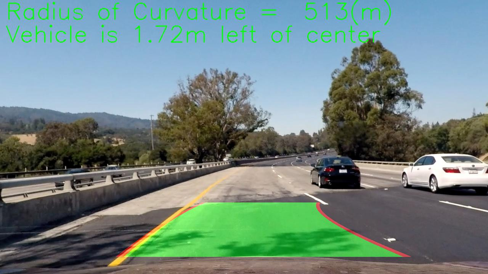
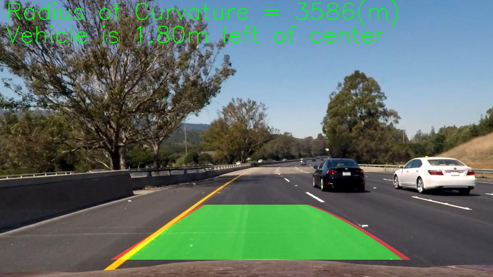

## PROJECT: ReND_Car_Advanced-Lane-Lines
> AUTHOR: SungwookLE(joker1251@naver.com)  
> DATE: '21.3/11 
---

### [1] Introduction

The goals / steps of this project are the following:
* Compute the camera calibration matrix and distortion coefficients given a set of chessboard images.
* Apply a distortion correction to raw images.
* Use color transforms, gradients, etc., to create a thresholded binary image.
* Apply a perspective transform to rectify binary image ("birds-eye view").
* Detect lane pixels and fit to find the lane boundary.
* Determine the curvature of the lane and vehicle position with respect to center.
* Warp the detected lane boundaries back onto the original image.
* Output visual display of the lane boundaries and numerical estimation of lane curvature and vehicle position.
* [Rubric](https://review.udacity.com/#!/rubrics/571/view) Points is here

### [2] MAIN

#### [2-1] Camera Calibration
Using `cv2.findChessboardCorners`, `cv2.drawChessboardCorners`, Find and Save `objpoints` and `imgpoints`.
This `points` are chess check board that can make undistort the images. In this project, the chessboard images are
`camera_cal/calibration*.jpg`.

```python
# Chess board (9,6)
objp = np.zeros((6*9, 3), np.float32)
objp[:,:2] = np.mgrid[0:9, 0:6].T.reshape(-1,2) 

for fname in images:
    img = cv2.imread(fname)
    gray = cv2.cvtColor(img, cv2.COLOR_BGR2GRAY)
    # Find the chessboard corners
    ret, corners = cv2.findChessboardCorners(gray, (9,6), None)

    if ret == True:
        imgpoints.append(corners)
        objpoints.append(objp)
        img = cv2.drawChessboardCorners(img, (9,6), corners, ret)
```

#### [2-2] Camera Undistortion
When using the single lense camrea, there is distortion effect. Therefore, `undistortion` process is needed.

```python
def cal_undistort(img, objpoints, imgpoints):
    img_size = (img.shape[1], img.shape[0]) # x, y
    ret, mtx, dist, rvecs, tvecs = cv2.calibrateCamera(objpoints, imgpoints, img_size, None, None)
    undist = cv2.undistort(img, mtx, dist, None, mtx)

    return undist
```
`objpoints` and `imgpoints` are used for `cv2.calibrateCamera` that returns 'ret','mtx','dist','rvecs','tvecs'.  
Those values are used for `cv2.undistort` that returns undistorted image. Those `cv2` members help camera processing.

#### [2-3] Image pixel Thresholding

This process is needed to pick the specific pixels. In general, Color space thresholding and Gradient thresholding as known as `sobel`. Those two thresholding function flow are exactly similar. First, converting to gray scale image. Second, dividing image channels. Third, comparing value in each pixel whether bigger or smaller or not.
Let's look at the each function.
```python
def color_thresholding(img, threshold=(0,255), opt=("rgb")):
    # read using mpimg as R.G.B
    img_in = np.copy(img)
    
    if (opt == "rgb"):
        rgb = img_in
        r_channel = rgb[:,:,0]
        g_channel = rgb[:,:,1]
        b_channel = rgb[:,:,2]

        r_binary = np.zeros_like(r_channel)
        r_channel = cv2.equalizeHist(r_channel)
        r_binary[(r_channel >= threshold[0]) & (r_channel <= threshold[1])]=1

        return r_binary
    
    elif (opt == "hls"):
        hls = cv2.cvtColor(img_in, cv2.COLOR_RGB2HLS)
        h_channel = hls[:,:,0]
        l_channel = hls[:,:,1]
        s_channel = hls[:,:,2]

        s_binary = np.zeros_like(s_channel)
        s_channel = cv2.equalizeHist(s_channel)
        s_binary[(s_channel >= threshold[0]) & (s_channel <= threshold[1])]=1

        return s_binary

    else:
        return img_in
```
Note: If you use `mpimg.imread()` then the image is composed of R.G.B channels. Otherwise, `cv.imread()` is composed of B.G.R channel.

You can see the code, If opt is "rgb", image is divided as R,G,B. `cv2.equalizeHist` is needed for robust thresholding. This function make image's histogram set flatten. And Finally, Comparing the pixel values. If that value is satisfied the threshold, then set `1`, if not, set `0`.  

Next is `gradient_thresholding`. It used `cv2.Sobel`. Sobel calculate pixel gradient value to each direction X, Y.
```python
def gradient_thresholding(img, threshold=(0,255), opt=("comb")):
    # read using mpimg as R.G.B
    img_in = np.copy(img)
    gray= cv2.cvtColor(img_in, cv2.COLOR_RGB2GRAY)
    gray = cv2.equalizeHist(gray)

    img_sobel_x = cv2.Sobel(gray, cv2.CV_64F, 1,0, ksize=3)
    img_sobel_y = cv2.Sobel(gray, cv2.CV_64F, 0,1, ksize=3)

    abs_sobelx = np.absolute(img_sobel_x)
    abs_sobely = np.absolute(img_sobel_y)

    scaled_sobelx = np.uint8(
        255*abs_sobelx / np.max(abs_sobelx)
    )
    scaled_sobely = np.uint8(
        255*abs_sobely / np.max(abs_sobely)
    )

    img_sobel_xy = np.sqrt(img_sobel_x**2 + img_sobel_y**2)
    scaled_sobelxy = np.uint8(
        255*img_sobel_xy / np.max(img_sobel_xy)
    ) 

    direction = np.arctan2(abs_sobelx, abs_sobely)

    if (opt == "comb"):
        
        binary_comb = np.zeros_like(scaled_sobelxy)
        binary_comb[
            (scaled_sobelxy >= threshold[0]) & (scaled_sobelxy <= threshold[1])
        ]=1

        return binary_comb
    
    elif (opt == "x"):
        
        binary_x = np.zeros_like(scaled_sobelx)
        binary_x[
            (scaled_sobelx >= threshold[0]) & (scaled_sobelx <= threshold[1])
        ]=1

        return binary_x

    elif (opt == "y"):
        
        binary_y = np.zeros_like(scaled_sobely)
        binary_y[
            (scaled_sobely >= threshold[0]) & (scaled_sobely <= threshold[1])
        ]=1

        return binary_y

    elif (opt =="dir"):

        binary_dir = np.zeros_like(direction)
        binary_dir[
            (direction >= threshold[0]) & (direction <= threshold[1])
        ]=1
        return binary_dir
    else:
        return img_in
```
Almost same with 'color_thresholding`. 
`img_sobel_x = cv2.Sobel(gray, cv2.CV_64F, 1,0, ksize=3)`, `img_sobel_y = cv2.Sobel(gray, cv2.CV_64F, 0,1, ksize=3)`. Those `cv2.Sobel` calculate pixel gradient values. Those values is compared threshold value. you may note that `opt=="dir"`. when this is selected,`direction = np.arctan2(abs_sobelx, abs_sobely)` is calculated.

#### [2-3] Bird Eye View (Transforming to Perspective Image)
Using `cv2.getPerspectiveTransform(Source, Destination)`, get the perspective transformation matrix `M`. Next, using `cv2.warpPerspective`, the final Bird Eye view image was acquired.

| Source        | Destination   | 
|:-------------|:-------------| 
| 490, 535      | margin, margin             | 
| 835, 535      | x_len-margin, margin       |
| 1080, 650     | x_len-margin, y_len-margin |
| 265, 650      | margin, y_len-margin       |
||*NOTE: margin=50*|
|||

```python
def perspective_img(image, region_rect, mode=("normal")):
    img_in = np.copy(image)
    x_len = img_in.shape[1]
    y_len = img_in.shape[0]

    if (mode == "normal"):
        src_pts = np.array(region_rect)
        margin=50
        warp_rect = np.array([[margin, margin] ,[x_len-margin, margin], [x_len-margin, y_len-margin], [margin, y_len-margin]], np.float32)
        out_pts = np.array(warp_rect)
    
    else: #inverse
        margin=50
        warp_rect = np.array([[margin, margin] ,[x_len-margin, margin], [x_len-margin, y_len-margin], [margin, y_len-margin]], np.float32)
        src_pts = np.array(warp_rect)
        out_pts = np.array(region_rect)

    M = cv2.getPerspectiveTransform(src_pts, out_pts)
    warp = cv2.warpPerspective(img_in, M, (x_len, y_len))
    
    return warp
```

#### [2-4] Lane Pixel Finding (Search around pre-defined priority)
This is the Key Function of this project. In order to make it better, I used the priority lane model. proper lane pixel candidates were choosen in prior defined lane model coefficients.
Lane model was designed as 2nd order model as  
$$
y=a_0*x^2 +a_1*x +a_2
$$

```python
init_left_fit = np.array([8.22279110e-05, -8.01574626e-02, 1.80496286e02])
init_right_fit = np.array([9.49537809e-05, -9.58782039e-02, 1.18196061e03])
```
In this case, init_left_fit[0] is $a_0$ and init_left_fit[1] is $a_1$ and init_left_fit[2] is $a_2$.  

The `search_around_poly` is the my function to search the lane pixel.
Let's look at the code. 

```python
def search_around_poly(binary_warp, init_tune):
    binary_warped = np.copy(binary_warp)

    margin = 100

    nonzero = binary_warped.nonzero() # nonzero index return!
    nonzerox = np.array(nonzero[1])
    nonzeroy = np.array(nonzero[0])

    left_lane_inds = (
        nonzerox
        > (
            init_tune[0][0] * (nonzeroy) ** 2
            + init_tune[0][1] * nonzeroy
            + init_tune[0][2]
            - margin
        )
    ) & (
        nonzerox
        < (
            init_tune[0][0] * (nonzeroy) ** 2
            + init_tune[0][1] * nonzeroy
            + init_tune[0][2]
            + margin
        )
    )

    right_lane_inds = (
        nonzerox
        > (
            init_tune[1][0] * (nonzeroy) ** 2
            + init_tune[1][1] * nonzeroy
            + init_tune[1][2]
            - margin
        )
    ) & (
        nonzerox
        < (
            init_tune[1][0] * (nonzeroy) ** 2
            + init_tune[1][1] * nonzeroy
            + init_tune[1][2]
            + margin
        )
    )

    leftx = nonzerox[left_lane_inds]
    lefty = nonzeroy[left_lane_inds]

    rightx = nonzerox[right_lane_inds]
    righty = nonzeroy[right_lane_inds]

    left_fitx, right_fitx, ploty,  left_fit_coef, right_fit_coef = fit_polynomial(binary_warped.shape, leftx, lefty, rightx, righty)
    left_right_coeff = np.array([left_fit_coef, right_fit_coef])

    ## VISUALIZATION FOR TESTING
    #plt.plot(left_fitx, ploty, color='yellow')
    #plt.plot(right_fitx, ploty, color='blue')

    return binary_warped, left_fitx, right_fitx, ploty, left_right_coeff
```
This code found proper lane pixel in the pre-defined prior lane model. And Next, Call the `fit_polynomial(found lane pixel)` to calculate new lane fitting model.

```python
def fit_polynomial(img_shape, leftx, lefty, rightx, righty):
    
    ploty = np.linspace(0, img_shape[0]-1, img_shape[0])

    try: #2nd order linear model was fitted using np.polyfit
        left_fit_coef = np.polyfit(lefty,leftx,2)
        right_fit_coef = np.polyfit(righty, rightx, 2)

        left_fitx= left_fit_coef[0]*ploty**2 + left_fit_coef[1]*ploty + left_fit_coef[2]
        right_fitx = right_fit_coef[0]*ploty**2 + right_fit_coef[1]*ploty + right_fit_coef[2]

    except TypeError:
        left_fitx = ploty
        right_fitx = ploty
        left_fit_coef = None
        right_fit_coef = None
    
    return left_fitx, right_fitx, ploty, left_fit_coef, right_fit_coef
```

using `np.polyfit`, the new lane model coefficients were acquired each left and right model. 

#### [2-5] Calculating real distance, curvature value (Measuring Curvature)

Next One is for getting real distance and curvature using camera real distance per pixel. In this case the cameral pixel values are below.
```
ym_per_pix = 30 / 720  # meters per pixel in y dimension
xm_per_pix = 3.7 / 1000  # meters per pixel in x dimension
ratio = [xm_per_pix, ym_per_pix]
```

Let's look at the defined function `measure_curvature`.

```python
def measure_curvature(image, left_fitx, right_fitx, ploty, ratio=(1,1)):
    # Image x size
    img_x_size = image.shape[1] 

    left_fit_cr = np.polyfit(ploty * ratio[1], left_fitx * ratio[0], 2)
    right_fit_cr = np.polyfit(ploty * ratio[1], right_fitx * ratio[0], 2)

    y_eval = np.max(ploty) # it means the closest value from the my vehicle.

    # Calculation of R_curve (radius of curvature)
    left_curverad = (
        1 + (2 * left_fit_cr[0] * y_eval * ratio[1] + left_fit_cr[1]) ** 2
    ) ** 1.5 / np.absolute(2 * left_fit_cr[0])
    right_curverad = (
        1 + (2 * right_fit_cr[0] * y_eval * ratio[1] + right_fit_cr[1]) ** 2
    ) ** 1.5 / np.absolute(2 * right_fit_cr[0])

    mean_curverad = np.mean([left_curverad, right_curverad])

    left_x = (
        left_fit_cr[0] * (y_eval * ratio[1]) **2 
        + left_fit_cr[1] * (y_eval * ratio[1])
        + left_fit_cr[2]
    )
    left_of_center = (img_x_size / 2) * ratio[0] - left_x

    return left_curverad, right_curverad, mean_curverad, left_of_center
```
You can see, real pixel values are adapted, and get polyfit coefficients again. the calculate curvature and lateral distance.

#### [2-6] OVERALL Processing (Returning the Final processing results including visualization)

I would like to explain the Overall processing function, in `process_img(image)`, the all needed functions were executed following proper step.

```python
def process_img(image):
    process_img.running_flag += 1
    
    img = np.copy(image)

    # step 1: undistortion
    undist = cal_undistort(img, objpoints, imgpoints)
```
This is the **step 1: undistortion**.
```python
    # step 2: Thresholding (Color, Gradient, Combination)
    color = color_thresholding(undist, threshold=(55, 255), opt="hls")
    gradient_comb = gradient_thresholding(undist,threshold=(60, 200), opt="comb" )
    gradient_dir = gradient_thresholding(undist,threshold=(0*np.pi/180,50*np.pi/180), opt="dir" )

    thd_img = np.zeros_like(gradient_comb)
    thd_img[
        (color ==1) & ((gradient_comb==1) | (gradient_dir==1)) 
    ]=1
```
This is the **step 2: Thresholding**.
```python   
    # step 3: perspective(bird eye)
    region_rect= np.array([[490, 535], [835, 535], [1080, 650], [265, 650]], np.float32)

    ## DEBUG: ROI CHECK
    #rect_samp = np.array([[490, 515], [835, 515], [1080, 650], [265, 650]], np.int)
    #cv2.polylines(thd_img, [rect_samp], True, (255,255,255), 10)
    #return thd_img

    warp_img = perspective_img(thd_img, region_rect, mode="normal")
```
This is the **step 3: Perspective**.
```python
    # step 4: Search from Prior
    init_left_fit = np.array([8.22279110e-05, -8.01574626e-02, 1.80496286e02])
    init_right_fit = np.array([9.49537809e-05, -9.58782039e-02, 1.18196061e03])
    if ( process_img.running_flag < 2 or (process_img.left_right_coeff[0] is None) or (process_img.left_right_coeff[1] is None) ):
        init_tune = np.array([init_left_fit, init_right_fit])
    else:
        if ( np.sum(np.abs(init_left_fit - process_img.left_right_coeff[0])) < 500   ) and ( np.sum(np.abs(init_right_fit - process_img.left_right_coeff[1])) < 600 ):
            init_tune = process_img.left_right_coeff
        else:
            init_tune = np.array([init_left_fit, init_right_fit])

    polyfit_img, left_fitx, right_fitx, ploty, process_img.left_right_coeff = search_around_poly(warp_img, init_tune)
```
This is the **step 4: Search from prior**.
```python
    # step 5: measure Curvature.
    ym_per_pix = 30 / 720  # meters per pixel in y dimension
    xm_per_pix = 3.7 / 1000  # meters per pixel in x dimension
    ratio = [xm_per_pix, ym_per_pix]
    left_curverad, right_curverad, mean_curverad, left_of_center = measure_curvature(polyfit_img, left_fitx, right_fitx, ploty, ratio=ratio)
    #print("Mean_CurveRad: ", mean_curverad, "Left_of_Center: ", left_of_center)

    str_curv1 = (
        "Radius of Curvature =%5d" % mean_curverad
        + "(m)")
    str_curv2 = ("Vehicle is %.2f" % left_of_center
        + "m left of center"
    )
```
This is the **step 5: Measure Curvature**.
```python
    # step 6: Inverse Warp
    # Create an image to draw the lines on
    warp_zero = np.zeros_like(polyfit_img).astype(np.uint8)
    color_warp = np.dstack((warp_zero, warp_zero, warp_zero))

    # Recast the x and y points into usable format for cv2.fillPoly()
    pts_left = np.array([np.transpose(np.vstack([left_fitx, ploty]))])
    pts_right = np.array([np.flipud(np.transpose(np.vstack([right_fitx, ploty])))])
    pts = np.hstack((pts_left, pts_right))

    # Draw the Lane onto the warped blank image
    cv2.fillPoly(color_warp, np.int_([pts]), (0,255,0))
    draw_line_left = np.int_(np.column_stack([left_fitx, ploty]))
    draw_line_right = np.int_(np.column_stack([right_fitx, ploty]))
    cv2.polylines(color_warp, [draw_line_left], False, (255,0,0), 25)
    cv2.polylines(color_warp, [draw_line_right], False, (255,0,0), 25)
    # Warp the blank back to original image space using inverse perspective matrix (Minv)
    Lane_warp_back = perspective_img(color_warp, region_rect, mode="inverse")
```
This is the **step 6: Inverse warp** For visualization works.

```python
    # step 7: Visualization
    # Combine the result with the original image
    result_img = cv2.addWeighted(undist, 1, Lane_warp_back, 0.5, 0)
    
    cv2.putText(
        result_img,
        str_curv1,
        (15, 50),
        cv2.FONT_HERSHEY_SIMPLEX,
        fontScale=2,
        color=(0,255,0),
        thickness=2,
    )
    cv2.putText(
        result_img,
        str_curv2,
        (15, 110),
        cv2.FONT_HERSHEY_SIMPLEX,
        fontScale=2,
        color=(0,255,0),
        thickness=2,
    )
    
    return result_img
```
This is **step 7: Visualization**. It puts the text about curvature anc lateral distance to image.

### [3] RESULTS

* Image outputs
1. 
2. 
3. 
4. 
5. 
6. 

* Video output  
1. [Challenge_video](./output_videos/out_challenge_video.mp4)  
2. [Harder_Challenge_video](./output_videos/out_harder_challenge_video.mp4)  
3. [Project_video](./output_videos/out_project_video.mp4)  

### [4] DISCUSSION
When I tesing this function to real camera (web-cam). There was latency to process image. For real adaptation of this algorithm, It would be needed code optimization to make it fast working.


